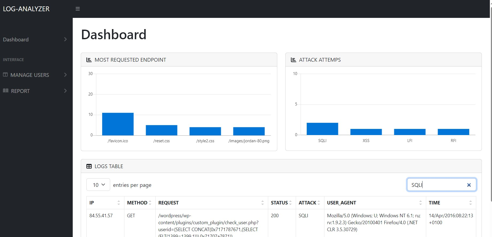
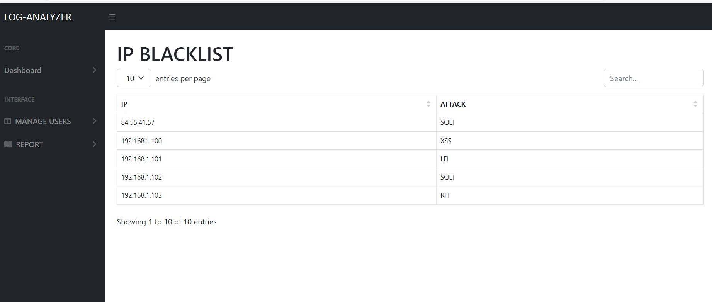
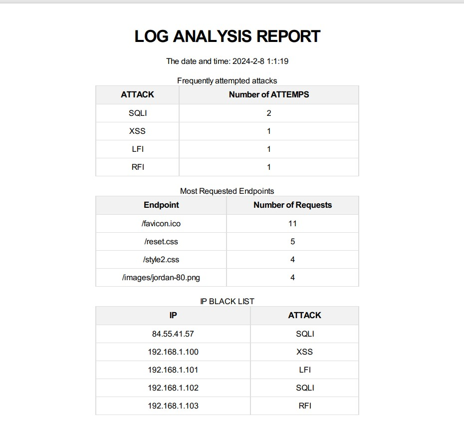

# LOG-ANALYZER

This project automates web server log analysis, focusing on Apache server logs, and detects web attacks. Additionally, it features a user-friendly dashboard for enhanced monitoring and visualization.

# Key Features
1. **Comprehensive Dashboard:** : Ensure all web server logs are visually presented effectively for optimal understanding.
2. **Web Attack Detection:**  : Automatically identify and report web attack.
3. **Detailed Reports:**  : Generate a comprehensive report showcasing key statistics for insightful analysis

## How to Run

Follow these steps to set up and run the LOG-ANALYZER  on your local machine:

1. **Clone the Repository:** : git clone https://github.com/abd3lgh4f0r/LOG-ANALYZER.git
2. **Install Dependencies:** :
   - pip install -r requirements.txt
   -  install wkhtmltopdf and Define path to wkhtmltopdf.exe
   
4. **Run this Script:**: python log-analyzer.py
5. **Access the Web Interface** : Open your web browser and navigate to http://localhost:5000 (or the specified port in your configuration)

## Screenshots

Here are some screenshots showcasing the LOG-ANALYZER:

- **DASHBOARD:**
  
  *Screenshot of the Dashboard interface.*

- **IP BLACK LIST:**
  
  *Screenshot of the IP BlackList Interface.*

 - **LOG ANALYSIS REPORT:**
 
  *Screenshot of the ANALYSIS REPORT.*

  
